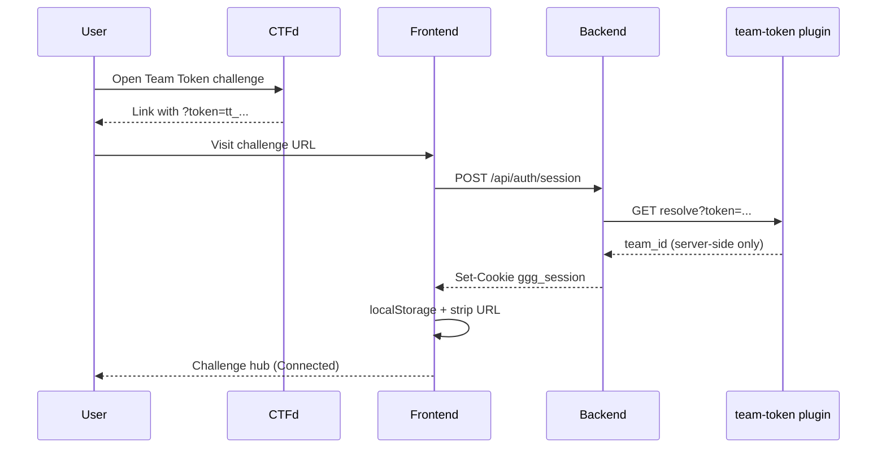
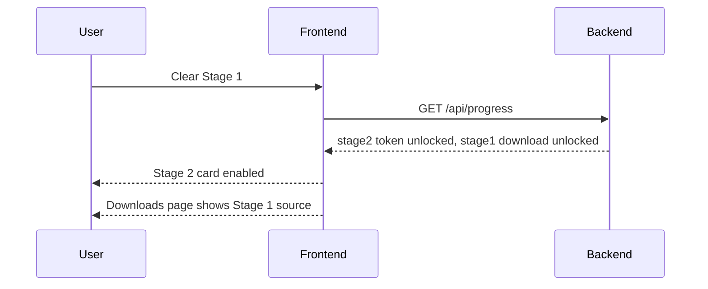

# Frontend Flow Spec

## Scope

This document defines:

- page structure
- stage navigation
- lock/unlock behavior
- status panels
- source download UX
- how-to-play modals
- **team token bootstrap and session persistence**

Auth spec: [PRD-TRD-shared-instance-team-token-auth.md](PRD-TRD-shared-instance-team-token-auth.md)

It is intentionally frontend-first, but backend teams should treat its payload expectations as a contract.

## Authentication Bootstrap

On first load:

1. Read `?token=` from URL (CTFd description link)
2. If present → `POST /api/auth/session` with token
3. On success:
   - persist token to `localStorage` key `ggg_team_token`
   - strip token from URL via `history.replaceState`
4. If no URL token but `localStorage` has token and session invalid → silent re-bootstrap
5. If neither → show unauthenticated landing ("Open this challenge from CTFd")

Subsequent navigation uses session cookie only. Do not send token on every API call.

UI must never display CTFd team id, team name, or internal identifiers. Session area shows "Connected" when authenticated.

## Top-Level Pages

- `/` landing page
- `/progress`
- `/downloads`
- `/play/pinpoint`
- `/play/queens`
- `/play/tango`

## Navigation

Top nav should include:

- Home
- Progress
- Downloads
- connection status ("Connected" / "Not connected" — no team name)

Stage navigation can appear on the landing page and in a side panel on stage pages.

## Landing Page

Show:

- title: `Go Going Goen`
- three challenge cards
- one-line description per stage
- lock status per stage
- `Play` or `Locked` button

Suggested card copy:

- `Pinpoint`: blind word guessing with a hard attempt cap
- `Queens`: validate a large board under strict row/column rules
- `Tango`: solve a logic grid and purchase the final flag with `$` credits

## Progress Page

Show:

- cleared state for each stage
- unlocked stage tokens
- current mutable status summary per stage
- `Reset All` button

The progress page is the authoritative place to recover unlock state after a player loses terminal output.

## Downloads Page

Show three rows:

- Stage 1 source
- Stage 2 source
- Stage 3 source

Each row includes:

- status: locked/unlocked
- download button if unlocked
- short note describing what is inside

## Shared Stage Page Layout

Each stage page should contain:

- stage title
- game panel
- status box
- `How to Play` button
- `Reset` button
- source download shortcuts for already-unlocked prior stages

Do not put exploit hints in the UI copy.

## How To Play Modals

### Stage 1 modal

- Guess the hidden word.
- You have 5 guesses.
- Each guess returns only `correct` or `wrong`.

### Stage 2 modal

- Build a board on a 50x50 grid.
- A valid board may have at most one queen in each row and column.
- Submit validates the board.
- Winning requires a total queen count of at least `1337`.

### Stage 3 modal

- Complete the Tango grid by toggling each editable tile between blank, sun, and moon.
- Fixed clue tiles cannot be changed.
- A valid submission awards `$` ledger credits.
- The final flag is purchased with `$` ledger credits.

## What Gets Shown When

### Before Stage 1 clear

- Stage 1 playable
- Stage 2 locked
- Stage 3 locked
- no source downloads

### After Stage 1 clear

- Stage 2 playable
- Stage 1 source unlocked
- Stage 2 token visible on progress page

### After Stage 2 clear

- Stage 3 playable
- Stage 2 source unlocked
- Stage 3 token visible on progress page

### After Stage 3 clear

- final result or flag shown
- optional Stage 3 source unlocked

## Polling and Refresh Behavior

Frontend should poll only where necessary.

Recommended:

- Stage 2 page polls board/status every 500ms to 1000ms during active validation
- Stage 3 page polls attempt/ledger status every 500ms during active validation
- no aggressive polling on Stage 1

## Stage 1 UI Contract

Main controls:

- text input
- submit guess button

Status box should show:

- guesses used
- remaining guesses
- last result as `correct` or `wrong`

Do not show:

- partial letter feedback
- dictionary hints

## Stage 2 UI Contract

Main controls:

- board viewport with row/column labels
- add queen action
- remove queen action
- submit board button

Status box should show:

- total queens
- submission `status`
- rounded `progress_pct`
- last submit result

The page should make it easy to perform many add/remove actions quickly.

## Stage 3 UI Contract

Main controls:

- Tango grid display with fixed clues
- clickable editable tiles that cycle `empty -> sun -> moon -> empty`
- submit grid button
- ledger panel with `$` balances
- buy flag button
- optional latest attempt refresh

Status box should show:

- spendable `$`
- pending `$`
- committed `$`
- latest attempt state if available

Frontend state contract:

- represent cells as integer values, not strings
- `0` means empty
- `1` means sun
- `2` means moon
- render icons or labels from those values at the UI boundary only
- prevent clicks on fixed clue cells

## Frontend Ownership Boundary

Frontend owner is responsible for:

- routing and page composition
- **token bootstrap, localStorage persistence, URL cleanup**
- lock/unlock display
- how-to-play modals
- polling behavior
- download buttons

Stage owners are responsible for:

- stage-specific payload fields
- any stage-specific rendering helpers they need to expose

## Sequence Diagram: Auth Bootstrap

## Sequence Diagram: Unlock Flow

