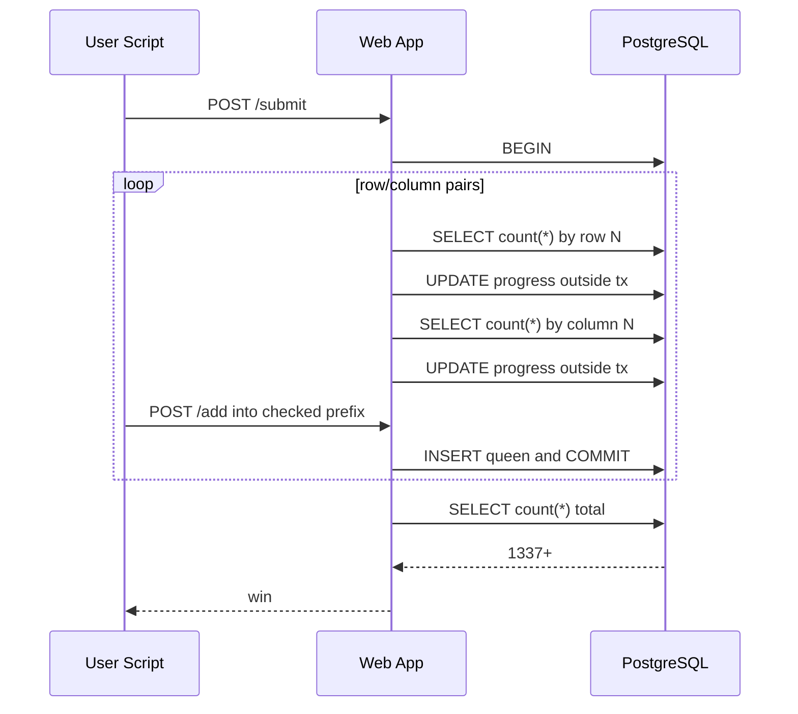

# Stage 2 Spec - Queens

## Purpose

Stage 2 is the main transactional race.

It should teach:

- a transaction is not automatically safe
- PostgreSQL `READ COMMITTED` matters
- validation order plus concurrent mutation can break invariants

## Core PostgreSQL Assumption

This stage intentionally relies on PostgreSQL default `READ COMMITTED`.

Why it matters:

- each `SELECT` in the validation transaction gets a fresh snapshot
- concurrent committed inserts from another request can become visible to later statements
- earlier validation statements do not protect later final-count statements

This is a core mechanic, not an incidental implementation detail.

## Game Rules

- 50x50 board
- a valid board has at most one queen in every row
- a valid board has at most one queen in every column
- the visible win condition is total queens `>= 1337`

That visible win condition is impossible under valid play, which should push players toward exploit thinking.

## Intended Exploit

1. start with a legal board
2. start a submission
3. while validation alternates through row/column pairs, add queens into the already-checked prefix square
4. let final count read a now-illegal but much larger board
5. exceed threshold and unlock Stage 3

## Tables

```sql
CREATE TABLE queens_positions (
    id SERIAL PRIMARY KEY,
    user_id INT NOT NULL REFERENCES users(id),
    row_idx INT NOT NULL,
    col_idx INT NOT NULL,
    created_at TIMESTAMP NOT NULL DEFAULT now(),
    UNIQUE (user_id, row_idx, col_idx)
);

CREATE TABLE queens_submissions (
    user_id INT PRIMARY KEY REFERENCES users(id),
    status TEXT NOT NULL DEFAULT 'idle',
    progress_pct INT NOT NULL DEFAULT 0,
    last_result TEXT,
    last_submitted_at TIMESTAMP,
    updated_at TIMESTAMP NOT NULL DEFAULT now()
);
```

Do not put uniqueness constraints on `(user_id, row_idx)` or `(user_id, col_idx)`.
The broken logic must live in application validation, not DB constraints.
Do enforce exact-square uniqueness so each square toggles between empty and occupied.

## Routes

### `GET /api/v2/queens/board`

Returns:

```json
{
  "size": 50,
  "queens": [
    {"row": 0, "col": 0},
    {"row": 1, "col": 1}
  ],
  "total_queens": 2,
  "submission": {
    "status": "validating",
    "progress_pct": 20,
    "last_result": "pending"
  }
}
```

### `POST /api/v2/queens/add`

Request:

```json
{
  "row": 10,
  "col": 12
}
```

Behavior:

- insert queen if in bounds
- do nothing if that exact square is already occupied
- no global row/column uniqueness check
- commit immediately

Response:

```json
{
  "ok": true,
  "total_queens": 1
}
```

### `POST /api/v2/queens/remove`

Request:

```json
{
  "row": 10,
  "col": 12
}
```

Deletes one matching queen if present.

### `POST /api/v2/queens/submit`

Behavior:

1. mark submission as validating with `progress_pct = 0` outside main transaction
2. begin transaction
3. check row `0`, then column `0`
4. update progress outside the main transaction after each check
5. continue as row `1`, column `1`, row `2`, column `2`, and so on
6. validation work itself should be observable to polling clients; prefer DB-backed validation audit work over fixed sleeps so the race window comes from real PostgreSQL activity
7. each validation step should also persist checked-prefix occupancy metadata in the audit path so operators can inspect how much of the already-checked square was occupied at that moment
8. compute final `count(*)`
9. if count >= threshold, mark clear and unlock Stage 3
10. commit or return validation failure

Success on normal valid but not winning board:

```json
{
  "result": "valid",
  "total_queens": 0
}
```

Success on exploit:

```json
{
  "result": "win",
  "total_queens": 1337
}
```

Failure:

```json
{
  "error": "invalid_board",
  "message": "Board failed validation."
}
```

### `POST /api/v2/queens/reset`

Resets:

- board back to the default empty layout
- submission status to idle
- progress to 0

Preserves:

- Stage 3 unlock if already earned

## Default Starting Board

Start with no queens on the board.

Each square is single-occupancy. Re-adding an occupied square should not create stacked queens.

## Validation Pseudo-Code

```python
set_submission_status(user_id, "validating", 0)

with db.transaction():
    for idx in range(50):
        c = db.fetch_val(
            """
            SELECT count(*)
            FROM queens_positions
            WHERE user_id = %s AND row_idx = %s
            """,
            [user_id, idx],
        )
        if c > 1:
            set_submission_status(user_id, "failed", progress_for_row(idx))
            raise InvalidBoard()
        maybe_update_progress_outside_tx(user_id, progress_for_row(idx))

        c = db.fetch_val(
            """
            SELECT count(*)
            FROM queens_positions
            WHERE user_id = %s AND col_idx = %s
            """,
            [user_id, idx],
        )
        if c > 1:
            set_submission_status(user_id, "failed", progress_for_col(idx))
            raise InvalidBoard()
        maybe_update_progress_outside_tx(user_id, progress_for_col(idx))

    total = db.fetch_val(
        "SELECT count(*) FROM queens_positions WHERE user_id = %s",
        [user_id],
    )

    if total >= 1337:
        unlock_stage3(user_id)
        set_submission_status(user_id, "won", 100)
        return {"result": "win", "total_queens": total}

set_submission_status(user_id, "valid", 100)
return {"result": "valid", "total_queens": total}
```

## Progress Semantics

`progress_pct` deliberately exposes the validation rhythm.

Requirements:

- it should reveal that validation is ongoing
- it should be persisted outside the main validation transaction

Suggested mapping:

- row `n` maps to `n * 2`
- column `n` maps to `n * 2 + 1`
- final count and result set `100%`

After row `n`, rows `0..n` and columns `0..n-1` have been checked, so the newly safe cells are `(n, 0..n-1)`.
After column `n`, rows and columns `0..n` have both been checked, so the newly safe cells are `(0..n, n)`.
That still creates the intended expanding prefix square for the race while letting each validation step use one SQL query instead of walking individual cells.
The validation audit can also record derived prefix metadata such as checked-square occupancy; that extra work is part of the intended database-shaped race window, unlike an artificial fixed delay.

## Difficulty Target

Stage 2 should be:

- harder than Stage 1
- still clearly race-shaped
- solvable with a concurrent script and some timing refinement

Expected player work:

- observe polling updates
- infer the row/column pair from progress
- add queens aggressively into the already-checked prefix square
- iterate until they cross threshold

## Sequence Diagram - Exploit



## Ownership Boundary

Stage 2 owner must deliver:

- schema and seed board
- stage routes
- validation loop
- progress updates
- Stage 3 unlock hook
