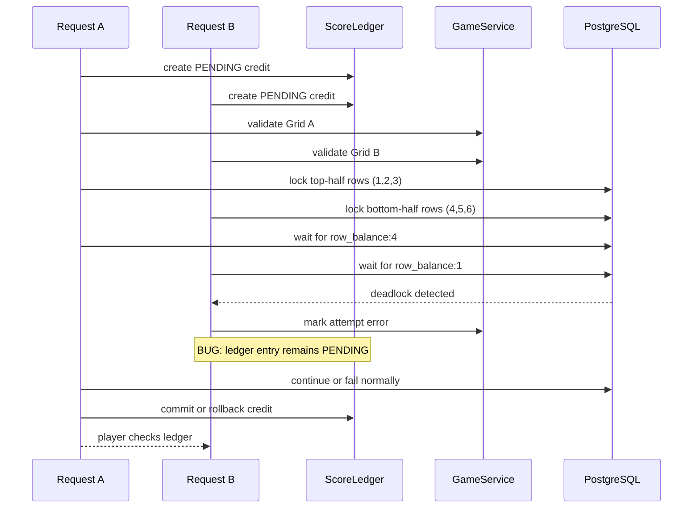

# Stage 3 Spec - Tango

## Purpose

Stage 3 is the final escalation from request racing into distributed-systems failure.

It should teach:

- a successful write in one subsystem is not proof that the whole operation committed
- compensation paths are part of correctness, not cleanup
- database deadlocks can be attacker-shaped when lock order depends on user input
- a saga can fail open when one participant treats `PENDING` as spendable state

The old Crossclimb projection-oracle design was too close to Stages 1 and 2. This version intentionally moves away from "spray many requests and observe a timing window" toward "send two precise requests that create a known lock inversion."

## Difficulty Positioning

Stage 3 should be harder than Stage 2 because the player must reason about a multi-step transaction boundary, not because the timing window is narrower.

Stage 1 difficulty:

- exploit a simple request race
- win by overlapping guesses before the attempt cap catches up

Stage 2 difficulty:

- exploit non-atomic validation under PostgreSQL `READ COMMITTED`
- mutate committed board state while validation is still reading it

Stage 3 difficulty:

- identify a saga boundary between the game validator and score ledger
- infer that validation lock order comes from submitted grid structure
- craft two payloads with inverted lock order
- trigger one deterministic PostgreSQL deadlock
- exploit the missing compensation path for the aborted validation transaction

This means:

- Stage 1 is about concurrency volume
- Stage 2 is about read/write interleaving
- Stage 3 is about precise deadlock construction and failed distributed compensation

## Anti-Spray Rules

Do not add proof-of-work.

Instead:

- allow at most 2 concurrent Stage 3 submissions per user
- reject or queue additional submissions with a short timeout
- make one valid exploit require exactly 2 in-flight requests
- make random spraying ineffective because only a specific lock-order inversion creates the useful failure

Implementation options:

- per-user in-process semaphore with capacity `2`
- small dedicated Stage 3 DB pool
- DB-backed `stage3_inflight` guard keyed by `user_id`

Preferred first implementation:

- use an in-process per-user semaphore for simplicity
- keep the deadlock itself in PostgreSQL so the bug is not simulated only in Python

## Concurrency Gate Requirements

The Stage 3 submission gate is part of challenge design, so implement it deliberately.

Required behavior:

- each user gets one semaphore with capacity `2`
- `POST /api/v3/tango/submit` must acquire one permit before creating attempts or ledger entries
- if no permit is available within a short timeout, return `429 too_many_submissions`
- permits must be released in a `finally` block
- reset must not rely on manually "decrementing" permits; it should clean stage-local DB state only
- a failed, deadlocked, rejected, timed-out, or client-disconnected request must still release its permit

Recommended shape:

```python
async with stage3_submission_gate.acquire(user_id, timeout=0.25):
    return await service.submit_grid(user_id, grid)
```

If the implementation uses raw semaphores instead of an async context manager:

```python
acquired = await acquire_with_timeout(user_id)
if not acquired:
    raise TooManySubmissions
try:
    return submit_grid(user_id, grid)
finally:
    release(user_id)
```

Do not keep the semaphore permit until flag purchase. The permit only protects active validation submissions.

## Game Rules

The visible game is a small Tango-style logic grid.

Player-facing rules:

- each cell contains `SUN`, `MOON`, or blank
- no row or column may contain three identical adjacent symbols
- each row and column must contain the same number of `SUN` and `MOON`
- some cells are fixed clues
- submitting a completed valid grid awards `$100`
- each accepted play records a `$100` play fee
- the flag costs `$1000`, so normal play nets to `$0` and can never reach the flag price

Challenge-specific twist:

- normal valid grids are not enough to buy the flag
- the player must create an extra spendable ledger credit through a saga compensation failure
- the intended exploit uses two malformed grids submitted concurrently

## Cell Encoding

Do not pass raw strings through the API or store raw strings in game payloads.

Use integer cell values everywhere:

- `0`: empty
- `1`: sun
- `2`: moon

Frontend labels/icons may render these as blank, sun, and moon, but frontend state, API payloads, backend models, tests, and exploit scripts should use the integer representation.

Type aliases:

```python
CellValue = Literal[0, 1, 2]
Grid = list[list[CellValue]]
```

TypeScript equivalent:

```ts
export type TangoCell = 0 | 1 | 2;
export type TangoGrid = TangoCell[][];
```

## Puzzle Source

Use a single fixed, solvable 6x6 board for the first implementation.

Do not build a board generator yet. Tango generation is easy to get subtly wrong, and Stage 3 complexity should come from the saga/deadlock exploit rather than puzzle generation.

Recommended hidden solution:

```json
[
  [1, 1, 2, 1, 2, 2],
  [1, 2, 2, 1, 1, 2],
  [2, 1, 1, 2, 2, 1],
  [1, 2, 1, 2, 1, 2],
  [2, 1, 2, 1, 2, 1],
  [2, 2, 1, 2, 1, 1]
]
```

Recommended fixed clues:

```json
[
  {"row": 0, "col": 0, "value": 1},
  {"row": 0, "col": 2, "value": 2},
  {"row": 1, "col": 5, "value": 2},
  {"row": 2, "col": 0, "value": 2},
  {"row": 3, "col": 3, "value": 2},
  {"row": 4, "col": 4, "value": 2},
  {"row": 5, "col": 1, "value": 2},
  {"row": 5, "col": 5, "value": 1}
]
```

The UI should let players solve this like the real Tango game:

- fixed clue tiles are not clickable
- modifiable tiles cycle `0 -> 1 -> 2 -> 0` on click
- tile visuals should be iconographic, not raw numbers or strings
- keyboard accessibility is nice-to-have but not required for the first implementation
- ledger balances should be displayed with a `$` prefix, for example `$100 / $1000`
- use "Ledger" or "Credits" in copy, but make the currency visually clear as dollars

Future enhancement:

- a generator can be added later if we want per-instance puzzles
- if added, generated boards must be uniquely solvable and must preserve deterministic deadlock payload construction

## Intended Bug

The app models two logical services inside one FastAPI app:

- `GameService`: validates Tango grids
- `ScoreLedger`: tracks credits used to buy the final flag

Submission flow:

1. `ScoreLedger` inserts a `PENDING` credit for the attempt.
2. `GameService` validates the submitted grid in a separate transaction.
3. If validation succeeds, the ledger credit is marked `COMMITTED`.
4. If validation fails normally, the ledger credit is marked `ROLLED_BACK`.
5. If validation raises a PostgreSQL deadlock error, the handler catches a generic database exception and marks only the game attempt as `ERROR`.
6. The deadlock path forgets to compensate the ledger credit, leaving it `PENDING`.
7. The flag purchase path incorrectly treats `PENDING` and `COMMITTED` credits as spendable.

That is the vulnerability. The deadlock is not the prize by itself; the missing saga compensation is.

## How The Two Precise Requests Work

Validation locks shared constraint rows based on features extracted from the submitted grid.

Example constraint keys:

- `row_balance:1`
- `row_balance:2`
- `row_balance:3`
- `row_balance:4`
- `row_balance:5`
- `row_balance:6`

For the first implementation, keep this deterministic but full-grid-derived:

- `derive_lock_order(grid)` uses all 6 rows, grouped as top half (`1..3`) and bottom half (`4..6`)
- compute `imbalance = sun_count - moon_count` per row, ignoring empty cells
- compute:
  - `top_half_imbalance = imbalance(row1) + imbalance(row2) + imbalance(row3)`
  - `bottom_half_imbalance = imbalance(row4) + imbalance(row5) + imbalance(row6)`
- if `abs(top_half_imbalance) >= abs(bottom_half_imbalance)`, lock rows in order:
  - `["row_balance:1", "row_balance:2", "row_balance:3", "row_balance:4", "row_balance:5", "row_balance:6"]`
- otherwise, lock rows in order:
  - `["row_balance:4", "row_balance:5", "row_balance:6", "row_balance:1", "row_balance:2", "row_balance:3"]`
- this preserves exactly two lock orders while making the signal come from full-grid features

Concrete examples:

- Grid A has stronger top-half imbalance than bottom-half imbalance, so lock order is:
  - `["row_balance:1", "row_balance:2", "row_balance:3", "row_balance:4", "row_balance:5", "row_balance:6"]`
- Grid B has stronger bottom-half imbalance than top-half imbalance, so lock order is:
  - `["row_balance:4", "row_balance:5", "row_balance:6", "row_balance:1", "row_balance:2", "row_balance:3"]`
- A valid solved grid should deterministically pick one canonical order; ties should resolve to top-half first.

The vulnerable validator locks rows in the order derived from those row imbalance features:

```python
first_key, second_key = derive_lock_order(grid)
SELECT * FROM tango_validation_locks WHERE lock_key = first_key FOR UPDATE
validate_first_region(grid, first_key)
SELECT * FROM tango_validation_locks WHERE lock_key = second_key FOR UPDATE
validate_second_region(grid, second_key)
```

The intended exploit crafts two grids:

- Grid A derives lock order `1,2,3 -> 4,5,6`
- Grid B derives lock order `4,5,6 -> 1,2,3`

Example malformed row groups using integer cell values:

```json
{
  "grid_a_top_half_rows_1_to_3": [
    [1, 1, 1, 1, 2, 2],
    [1, 1, 1, 2, 2, 0],
    [1, 1, 1, 2, 2, 0]
  ],
  "grid_a_bottom_half_rows_4_to_6": [
    [1, 2, 1, 2, 1, 2],
    [2, 1, 2, 1, 2, 1],
    [2, 2, 1, 2, 1, 1]
  ],
  "grid_b_top_half_rows_1_to_3": [
    [1, 2, 1, 2, 1, 2],
    [2, 1, 2, 1, 2, 1],
    [2, 2, 1, 2, 1, 1]
  ],
  "grid_b_bottom_half_rows_4_to_6": [
    [1, 1, 1, 1, 2, 2],
    [1, 1, 1, 2, 2, 0],
    [1, 1, 1, 2, 2, 0]
  ]
}
```

These rows are intentionally invalid as Tango solutions; they exist to shape lock acquisition. The source should make it possible to infer this without revealing it in UI copy.

When submitted together:

1. Request A obtains lock `row_balance:1`.
2. Request B obtains lock `row_balance:4`.
3. Request A continues through top-half locks and then waits on bottom-half locks held by B.
4. Request B continues through bottom-half locks and then waits on top-half locks held by A.
5. PostgreSQL detects the cycle and aborts one transaction with a deadlock error.
6. The aborted request leaves its ledger credit stuck as `PENDING`.

This is why two requests are enough. The payloads, not brute force, shape the lock graph.

## Determinism Requirements

The challenge should not depend on players winning a tiny scheduling race.

To make the exploit reliable:

- Stage 3 accepts at most two concurrent submissions per user.
- Validation performs enough deterministic work after the first lock that the peer request can reach its first lock.
- Use PostgreSQL row locks or advisory transaction locks for the actual deadlock.

Avoid:

- arbitrary `sleep()` calls as the core mechanic
- proof-of-work
- requiring dozens of attempts
- relying on random network jitter

Acceptable deterministic work after the first lock:

- validating all cells in the first locked region
- inserting region audit rows
- checking row/column balance constraints against a small table

If implementation needs an extra stabilizer, prefer a DB-backed "both validators reached first lock" barrier over a fixed sleep. The barrier must be scoped to the two submitted attempts and should time out quickly so failed exploit attempts do not wedge the instance.

Recommended barrier shape:

- after taking the first row lock, insert `(user_id, attempt_id, first_lock_key)` into a `tango_lock_barrier` table in the same validation transaction
- poll briefly until there are two live barrier rows for the same user with different first locks
- then continue to acquire the second lock
- timeout after roughly 250ms and continue normally

This keeps the challenge surgical without needing random sleeps. If the peer request is absent, validation proceeds and no useful pending credit is created.

Local reproduction note:

- PostgreSQL `deadlock_timeout` materially affects how quickly deadlock attempts resolve (commonly around `1s` by default).
- Keep this in mind when comparing local exploit runtime versus deployed instances.

## Tables

```sql
CREATE TABLE tango_state (
    user_id INT PRIMARY KEY REFERENCES users(id) ON DELETE CASCADE,
    puzzle_id TEXT NOT NULL DEFAULT 'default',
    updated_at TIMESTAMP NOT NULL DEFAULT now()
);

CREATE TABLE tango_attempts (
    attempt_id UUID PRIMARY KEY,
    user_id INT NOT NULL REFERENCES users(id) ON DELETE CASCADE,
    status TEXT NOT NULL,
    grid_payload JSONB NOT NULL,
    lock_order JSONB NOT NULL,
    created_at TIMESTAMP NOT NULL DEFAULT now(),
    updated_at TIMESTAMP NOT NULL DEFAULT now()
);

CREATE TABLE tango_ledger_entries (
    entry_id UUID PRIMARY KEY,
    attempt_id UUID NOT NULL REFERENCES tango_attempts(attempt_id) ON DELETE CASCADE,
    user_id INT NOT NULL REFERENCES users(id) ON DELETE CASCADE,
    status TEXT NOT NULL,
    amount INT NOT NULL,
    created_at TIMESTAMP NOT NULL DEFAULT now(),
    updated_at TIMESTAMP NOT NULL DEFAULT now()
);

CREATE TABLE tango_validation_locks (
    lock_key TEXT PRIMARY KEY
);

CREATE TABLE tango_region_audit (
    id SERIAL PRIMARY KEY,
    attempt_id UUID NOT NULL REFERENCES tango_attempts(attempt_id) ON DELETE CASCADE,
    user_id INT NOT NULL REFERENCES users(id) ON DELETE CASCADE,
    lock_key TEXT NOT NULL,
    region_payload JSONB NOT NULL,
    created_at TIMESTAMP NOT NULL DEFAULT now()
);

CREATE TABLE tango_lock_barrier (
    attempt_id UUID PRIMARY KEY REFERENCES tango_attempts(attempt_id) ON DELETE CASCADE,
    user_id INT NOT NULL REFERENCES users(id) ON DELETE CASCADE,
    first_lock_key TEXT NOT NULL,
    created_at TIMESTAMP NOT NULL DEFAULT now()
);
```

Seed `tango_validation_locks` with all lock keys that `derive_lock_order()` can return.

`grid_payload` must contain integer cell values only. Do not store `"SUN"`, `"MOON"`, or display labels in the database.

Recommended ledger states:

- `PENDING`
- `COMMITTED`
- `ROLLED_BACK`

Recommended attempt states:

- `pending`
- `validating`
- `accepted`
- `rejected`
- `error`

## Routes

### `GET /api/v3/tango/status`

Returns the puzzle, current ledger balance, and purchase status.

```json
{
  "puzzle": {
    "size": 6,
    "values": {
      "empty": 0,
      "sun": 1,
      "moon": 2
    },
    "fixed_cells": [
      {"row": 0, "col": 0, "value": 1},
      {"row": 0, "col": 2, "value": 2},
      {"row": 1, "col": 5, "value": 2},
      {"row": 2, "col": 0, "value": 2},
      {"row": 3, "col": 3, "value": 2},
      {"row": 4, "col": 4, "value": 2},
      {"row": 5, "col": 1, "value": 2},
      {"row": 5, "col": 5, "value": 1}
    ],
    "initial_grid": [
      [1, 0, 2, 0, 0, 0],
      [0, 0, 0, 0, 0, 2],
      [2, 0, 0, 0, 0, 0],
      [0, 0, 0, 2, 0, 0],
      [0, 0, 0, 0, 2, 0],
      [0, 2, 0, 0, 0, 1]
    ]
  },
  "ledger": {
    "currency_symbol": "$",
    "spendable_dollars": 0,
    "committed_dollars": 0,
    "pending_dollars": 0,
    "play_cost_dollars": 100,
    "flag_cost_dollars": 1000
  },
  "latest_attempt_state": "idle"
}
```

### `POST /api/v3/tango/submit`

Request:

```json
{
  "grid": [
    [1, 1, 2, 1, 2, 2],
    [1, 2, 2, 1, 1, 2],
    [2, 1, 1, 2, 2, 1],
    [1, 2, 1, 2, 1, 2],
    [2, 1, 2, 1, 2, 1],
    [2, 2, 1, 2, 1, 1]
  ]
}
```

Normal valid success:

```json
{
  "result": "accepted",
  "dollars_awarded": 100,
  "attempt_id": "uuid-here"
}
```

Normal invalid failure:

```json
{
  "error": "invalid_grid",
  "message": "Grid rejected.",
  "attempt_id": "uuid-here"
}
```

Deadlock failure:

```json
{
  "error": "validation_error",
  "message": "Validation could not complete.",
  "attempt_id": "uuid-here"
}
```

Important: the deadlock response must not directly reveal "deadlock" to the player. The source and ledger state should be enough.

### `GET /api/v3/tango/ledger`

Returns the ledger state.

```json
{
  "currency_symbol": "$",
  "spendable_dollars": 100,
  "committed_dollars": 0,
  "pending_dollars": 100,
  "entries": [
    {
      "entry_id": "uuid-here",
      "attempt_id": "uuid-here",
      "status": "PENDING",
      "amount": 100
    }
  ]
}
```

The vulnerable behavior is that `spendable_dollars` includes pending credits:

```sql
SUM(amount) FILTER (WHERE status IN ('PENDING', 'COMMITTED', 'PLAY_FEE'))
```

### `POST /api/v3/tango/ledger/refresh`

Reconciles abandoned `PENDING` entries back to `ROLLED_BACK`. This is intentionally an explicit action: passively reading `/ledger` still exposes the vulnerable spendable balance, but pressing Refresh Ledger in the UI settles the dangling credit and drops the balance back to `$0`.

### `POST /api/v3/tango/buy-flag`

Attempts to spend ledger dollars for the final flag.

Success:

```json
{
  "result": "win",
  "flag": "grey{...}"
}
```

Failure:

```json
{
  "error": "not_enough_credits",
  "message": "Not enough credits."
}
```

### `GET /api/v3/tango/attempt/:id`

Returns attempt status and derived lock order.

```json
{
  "attempt_id": "uuid-here",
  "status": "error",
  "lock_order": ["row_balance:4", "row_balance:5", "row_balance:6", "row_balance:1", "row_balance:2", "row_balance:3"],
  "ledger_status": "PENDING"
}
```

### `POST /api/v3/tango/reset`

Resets:

- stage-local attempts
- ledger entries
- region audit rows
- lock barrier rows
- in-flight guards

Preserves:

- user account
- Stage 1 and Stage 2 unlocks
- Stage 3 cleared state if already solved

## Vulnerable Handler Shape

```python
attempt_id = uuid4()
entry_id = uuid4()
lock_order = derive_lock_order(grid)

ledger.create_entry(
    entry_id=entry_id,
    attempt_id=attempt_id,
    user_id=user_id,
    status="PENDING",
    amount=100,
)

attempts.create(
    attempt_id=attempt_id,
    user_id=user_id,
    status="pending",
    grid=grid,
    lock_order=lock_order,
)

try:
    game_validator.validate(grid, attempt_id, user_id, lock_order)
except InvalidGrid:
    attempts.set_status(attempt_id, "rejected")
    ledger.set_status(entry_id, "ROLLED_BACK")
    return invalid_grid(attempt_id)
except DatabaseError:
    # BUG: this catches deadlock errors but forgets ledger compensation.
    attempts.set_status(attempt_id, "error")
    return validation_error(attempt_id)

attempts.set_status(attempt_id, "accepted")
ledger.set_status(entry_id, "COMMITTED")
return accepted(attempt_id)
```

## Validator Lock Shape

```python
def validate(grid, attempt_id, user_id, lock_order):
    with validation_transaction() as tx:
        tx.execute(
            "UPDATE tango_attempts SET status = 'validating' WHERE attempt_id = %s",
            [attempt_id],
        )

        for lock_key in lock_order:
            tx.execute(
                """
                SELECT lock_key
                FROM tango_validation_locks
                WHERE lock_key = %s
                FOR UPDATE
                """,
                [lock_key],
            )
            validate_region(grid, lock_key)
            audit_region(tx, attempt_id, user_id, lock_key, grid)

        validate_full_grid(grid)
```

The deadlock must happen inside this validation transaction. Ledger creation happens before validation and in a separate transaction or separate logical service boundary.

## Transaction Boundary Requirements

The rollback behavior is the whole bug, so transaction boundaries must be explicit.

Required boundaries:

- `ledger.create_entry(..., status="PENDING")` commits before validation starts
- `attempts.create(..., status="pending")` commits before validation starts
- `game_validator.validate(...)` uses a separate transaction
- a deadlock abort rolls back only the validation transaction
- after a deadlock, the handler opens a new transaction to mark the attempt `error`
- the deadlock path must not update the ledger entry

Normal invalid rollback:

- validation detects a Tango rule failure without a database deadlock
- handler marks attempt `rejected`
- handler marks ledger entry `ROLLED_BACK`

Deadlock failure:

- PostgreSQL aborts the validation transaction
- any audit/barrier rows written inside that validation transaction roll back
- pre-existing `PENDING` ledger entry remains because it committed before validation
- handler marks attempt `error` in a fresh transaction
- handler forgets ledger compensation

Semaphore behavior is separate from database rollback. The semaphore permit must be released even when the deadlock path leaves the ledger entry pending.

## Exploit Walkthrough

1. Fetch `/status` to understand the fixed clues, `$100` play cost, and `$1000` flag cost.
2. Read source to find `derive_lock_order()`.
3. Craft Grid A so top-half imbalance dominates, yielding order `1,2,3 -> 4,5,6`.
4. Craft Grid B so bottom-half imbalance dominates, yielding order `4,5,6 -> 1,2,3`.
5. Submit Grid A and Grid B concurrently.
6. One request deadlocks and returns `validation_error`.
7. Repeat until `/ledger` shows `$1000` spendable pending credit.
8. Call `/buy-flag` before refreshing the ledger; pending credit is incorrectly spendable.

The intended solve script should use two concurrent requests per attempt, not a request flood.

## Sequence Diagram - Exploit



## Difficulty Tuning

If Stage 3 is too easy:

- require two pending credits plus one committed credit to buy the flag
- hide `lock_order` from `/attempt/:id` and expose it only in source
- derive lock order from subtle grid features rather than explicit fields

If Stage 3 is too hard:

- include `lock_order` in `/attempt/:id`
- make `/ledger` show pending entries clearly
- keep only two possible lock-order groups (`1,2,3 -> 4,5,6` or reverse) in the first version
- add an obvious source comment near the deadlock compensation bug

## Implementation Notes

- Prefer PostgreSQL row locks in `tango_validation_locks` over Python locks.
- Catch deadlock errors through psycopg's specific exception type internally, but return a generic `validation_error`.
- Keep the per-user concurrency gate at exactly 2 for Stage 3 submissions.
- Do not use proof-of-work.
- Do not make the flag endpoint require a race; the race/deadlock should be complete before purchase.
- Keep resets first-class and safe after partially failed saga attempts.

## Test Requirements

Backend tests must cover:

- fixed puzzle status returns integer `initial_grid`, integer fixed clues, and `$` ledger fields
- frontend/API payload validation rejects string cells like `"SUN"` and out-of-range integers
- valid fixed-board solution awards `$100` committed and records a `$100` play fee
- normal valid solutions net to `$0` and cannot buy the `$1000` flag
- normal invalid grid rolls ledger entry back to `ROLLED_BACK`
- simulated deadlock path leaves ledger entry `PENDING`
- spendable balance includes `PENDING` plus `COMMITTED`
- refresh ledger rolls `PENDING` entries back and resets spendable balance to `$0`
- buy-flag succeeds when spendable dollars reach `$1000`
- per-user semaphore allows exactly two concurrent submissions
- third concurrent submission returns `429 too_many_submissions`
- semaphore permit is released after success, invalid rejection, deadlock error, and unexpected exception
- reset clears attempts, ledger entries, region audit rows, lock barrier rows, and stage-local in-flight guards

Frontend tests or manual QA must cover:

- fixed clue tiles do not change when clicked
- editable tiles cycle `0 -> 1 -> 2 -> 0`
- API submit payload uses integer grids only
- ledger panel renders `$` balances clearly
- buy-flag button handles `not_enough_credits` and success states
- page loads on desktop and mobile widths

Exploit verification must cover:

- submit exactly two malformed deadlock grids concurrently
- observe one `PENDING` ledger entry
- repeat until `$1000` pending is spendable
- buy flag before refreshing the ledger
- do not require request spraying or proof-of-work

## Implementation Checklist

Backend:

- create `app/stages/stage3/sql/tango.sql`
- replace Crossclimb repository/service/router models with Tango names and routes
- add `TangoCell = Literal[0, 1, 2]` validation
- seed `tango_validation_locks`
- implement `derive_lock_order()` using top-half vs bottom-half full-grid imbalance
- implement a per-user async semaphore gate with `finally` release
- implement separate ledger, attempt, and validation transactions
- intentionally leave the deadlock compensation bug in place
- wire reset into shared `/api/reset`
- update source download manifest to include Tango files and schema

Frontend:

- rename Stage 3 route/copy to Tango
- render a 6x6 Tango grid
- maintain grid state as `0 | 1 | 2`
- prevent fixed clue mutation
- submit integer grid payloads
- render `$` ledger balances
- add buy-flag action
- update mock API to mirror integer cells and ledger dollars

Exploit:

- write `solve/exploit_stage3.py`
- use exactly two concurrent malformed submissions for the deadlock phase
- print final flag from `/api/v3/tango/buy-flag`

## Ownership Boundary

Stage 3 owner must deliver:

- schema
- Tango puzzle/status route
- submission route
- ledger route
- attempt route
- buy-flag route
- reset logic
- deterministic two-request exploit script
